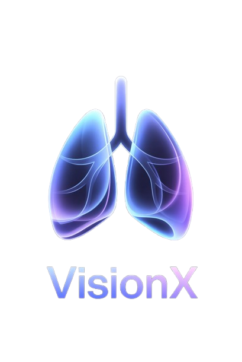

# VisionX - AI-Powered Chest X-Ray Pre-Diagnostic Tool

<div align="center">



### 🏆 2nd Place Winner - Hackathon UOI 2025

*An intelligent pre-diagnostic tool leveraging deep learning for chest X-ray analysis and risk stratification*

[](https://www.python.org/)
[](https://fastapi.tiangolo.com/)
[](https://pytorch.org/)

</div>

---

## 📑 Table of Contents

- [Media Showcase](#-media-showcase)
- [Project Vision](#-project-vision)
- [Key Features](#-key-features)
- [Risk Classification System](#-risk-classification-system)
- [Technical Architecture](#-technical-architecture)
- [Project Structure](#-project-structure)
- [Getting Started](#-getting-started)
  - [Prerequisites](#prerequisites)
  - [Installation](#installation)
  - [Running the Application](#running-the-application)
- [Acknowledgments](#-acknowledgments)
- [License](#-license)

---

## 🎬 Media Showcase

### Demo Video

---

## 🎯 Project Vision

**VisionX** aims to revolutionize early chest X-ray screening by providing healthcare professionals with an intelligent, AI-powered pre-diagnostic tool. Our mission is to:

- 🚀 **Accelerate Diagnosis**: Reduce initial screening time from hours to seconds
- 🎯 **Improve Accuracy**: Leverage state-of-the-art deep learning models trained on millions of X-rays
- 📊 **Risk Stratification**: Automatically prioritize critical cases requiring immediate attention
- 🔍 **Visual Explainability**: Provide Grad-CAM heatmaps to highlight regions of interest
- 🤖 **AI-Assisted Interpretation**: Generate clinical insights using advanced language models

### The Problem We Solve

In modern healthcare facilities, radiologists face an overwhelming volume of chest X-rays daily. VisionX serves as a **first-pass screening tool** that:

1. **Filters normal cases** from those requiring urgent attention
2. **Highlights potential pathologies** for radiologist review
3. **Organizes cases by risk level** to optimize workflow
4. **Provides visual explanations** to support diagnostic decisions

---

## ✨ Key Features

### 🔬 Advanced AI Analysis

- **Multi-Label Classification**: Simultaneous detection of 12 chest pathologies
- **DenseNet121 Architecture**: Pretrained on CheXpert dataset (224K+ chest X-rays)
- **High Performance**: 85%+ accuracy on validation datasets
- **Real-time Processing**: Results in under 3 seconds per image

### 👁️ Visual Explainability

- **Grad-CAM Heatmaps**: Visualize which regions influenced the model's prediction
- **Overlay & Standalone Views**: Compare original X-ray with AI attention maps

### 🎨 Dual Operating Modes

#### 1️⃣ Single Image Analysis
- Upload individual chest X-rays for detailed examination
- View top predicted pathologies with confidence scores
- Get AI-generated clinical interpretations
- Export results for medical records

#### 2️⃣ Batch Risk Classification
- Process multiple X-rays simultaneously (10-100+ images)
- Automatic risk stratification (High/Medium/Low/No Finding)
- Organized file output by risk category

### 🧠 AI Clinical Interpretation

- **LLM-Powered Explanations**: Gemini 2.5 Flash generates human-readable clinical insights
- **Context-Aware Analysis**: Considers probability distributions and multi-label predictions
- **Educational Content**: Explains pathology significance and common causes
- **Safety-First Design**: Emphasizes limitations and need for professional evaluation

---

## 🚨 Risk Classification System

VisionX uses a four-tier risk stratification system based on clinical urgency:

### ✅ No Finding (Normal)
**Conditions:** No significant pathology detected (all predictions < 30% confidence)

---

### 🟢 Low Risk
**Conditions:**
- Fracture

---

### 🟡 Medium Risk
**Conditions:**
- Atelectasis (lung collapse)
- Pleural Effusion (fluid around lungs)
- Cardiomegaly (enlarged heart)
- Enlarged Cardiomediastinum
- Lung Opacity

---

### 🔴 High Risk
**Conditions:**
- Consolidation (dense lung infiltrate)
- Pneumothorax (collapsed lung)
- Pulmonary Edema (fluid in lungs)
- Pneumonia (lung infection)
- Lung Lesion (mass/nodule)

---

## 🏗️ Technical Architecture

```
┌─────────────────────────────────────────────────────────────┐
│                        Frontend (HTML/CSS/JS)               │
│  ┌─────────────────┐  ┌──────────────┐  ┌───────────────┐  │
│  │  File Upload    │  │  Mode Toggle │  │  Results View │  │
│  │  (Drag & Drop)  │  │  (Single/    │  │  (Charts &    │  │
│  │                 │  │   Batch)     │  │   Heatmaps)   │  │
│  └────────┬────────┘  └──────┬───────┘  └───────▲───────┘  │
└───────────┼────────────────────┼──────────────────┼─────────┘
            │                    │                  │
            │      HTTP/REST API (CORS Enabled)     │
            │                    │                  │
┌───────────▼────────────────────▼──────────────────┼─────────┐
│                    FastAPI Backend                │         │
│  ┌─────────────────────────────────────────────────────┐   │
│  │  Endpoints:                                         │   │
│  │  • POST /predict        - Single image analysis     │   │
│  │  • POST /predict_batch  - Batch risk classification │   │
│  │  • POST /llm_explain    - AI interpretation         │   │
│  │  • GET  /               - Health check              │   │
│  └─────────────────┬──────────────────────────┬────────┘   │
│                    │                          │            │
│  ┌─────────────────▼────────┐  ┌──────────────▼─────────┐ │
│  │  Image Processing        │  │  Risk Classification   │ │
│  │  • Preprocessing         │  │  • Category Mapping    │ │
│  │  • Normalization         │  │  • File Organization   │ │
│  │  • Tensor Conversion     │  │  • Batch Summary       │ │
│  └─────────────────┬────────┘  └────────────────────────┘ │
│                    │                                       │
│  ┌─────────────────▼────────────────────────────────────┐ │
│  │           DenseNet121 Model (TorchXRayVision)        │ │
│  │  • 12 Pathology Classes                              │ │
│  │  • Sigmoid Output (Multi-label)                      │ │
│  │  					                                  │ │
│  └─────────────────┬────────────────────────────────────┘ │
│                    │                                       │
│  ┌─────────────────▼────────────────────────────────────┐ │
│  │        Grad-CAM Visualization (pytorch-grad-cam)     │ │
│  │  • Target Layer: features.norm5                      │ │
│  │  • Overlay Generation                                │ │
│  │  • Heatmap Coloring                                  │ │
│  └──────────────────────────────────────────────────────┘ │
│                                                            │
│  ┌─────────────────────────────────────────────────────┐  │
│  │     Gemini 2.5 Flash (LLM Integration)              │  │
│  │  • Clinical Analysis Generation                     │  │
│  │  • Safety-Aware Prompting                           │  │
│  │  • Structured Output Formatting                     │  │
│  └─────────────────────────────────────────────────────┘  │
└────────────────────────────────────────────────────────────┘
```

### Technology Stack

| Category | Technologies |
|----------|-------------|
| **Backend** | FastAPI, Python 3.8+, Uvicorn |
| **Deep Learning** | PyTorch, TorchXRayVision, pytorch-grad-cam |
| **LLM Integration** | Google Gemini 2.5 Flash |
| **Frontend** | HTML5, CSS3, Vanilla JavaScript |
| **Image Processing** | PIL (Pillow), NumPy, OpenCV |
| **Model** | DenseNet121 (pretrained on CheXpert) |
| **Deployment** | CORS-enabled REST API |

---

## 📁 Project Structure

```
VisionX/
├── backend/
│   ├── app_fastapi.py          # Main FastAPI application
│   ├── utils.py                # Helper functions & utilities
│   ├── requirements.txt        # Python dependencies
│   ├── test_api.py            # Single image API tests
│   ├── test_batch_api.py      # Batch processing tests
│   └── classified_images/     # Output directory for batch results
│       ├── High/              # High-risk cases
│       ├── Medium/            # Medium-risk cases
│       ├── Low/               # Low-risk cases
│       └── No Finding/        # Normal X-rays
│
├── frontend/
│   ├── index.html             # Main web interface
│   ├── style.css              # Styling & animations
│   └── VisionX.jpg            # Logo & branding
│
├── sample_uploads/            # Organized test dataset
│   └── patient*/study*/       # Patient-study-view hierarchy
│
├── sample_uploads_batch/      # Flat batch testing directory
│
├── 415.404-DiseaseNotFound.pptx  # Project presentation
├── VisionX_demo.mp4           # Demo video
├── ModelTesting.ipynb         # Jupyter notebook for experiments
├── requirements.txt           # Global dependencies
└── README.md                  # This file
```

---

## 🚀 Getting Started

### Installation

#### 1. Before you begin, ensure you have the following installed:

```bash
pip install -r requirements.txt
```

#### 2. Configure API Keys

```bash
# Fill your Google Gemini API Key (for AI explanations) on line-22 on app_fastapi.py
GEMINI_API_KEY = ""  # TODO: Add your Gemini API key here
```

> Get your free API key at [Google AI Studio](https://makersuite.google.com/app/apikey)

### Running the Application

#### Step 1: Start the Backend Server

```bash
cd backend
python app_fastapi.py
```

#### Step 2: Start the Frontend

```bash
# In a new terminal
cd frontend
python -m http.server 3000
```

Frontend available at: **http://localhost:3000**

#### Step 3: Access the Application

Open your browser and navigate to:
- **Frontend UI**: http://localhost:3000
- **Health Check**: http://localhost:8000/

---

## 🎓 Acknowledgments

### Open Source Projects
- [TorchXRayVision](https://github.com/mlmed/torchxrayvision) by Joseph Paul Cohen - Medical imaging models
- [CheXpert Dataset](https://stanfordmlgroup.github.io/competitions/chexpert/) by Stanford ML Group
- [FastAPI](https://fastapi.tiangolo.com/) by Sebastián Ramírez - Modern web framework
- [Grad-CAM](https://github.com/jacobgil/pytorch-grad-cam) by Jacob Gildenblat - Visualization library
- [Google Gemini](https://deepmind.google/technologies/gemini/) - LLM integration

### Special Thanks
- University of Ioannina for hosting the hackathon
- Open-source community for incredible tools and resources

---

## ⚠️ Medical Disclaimer

**VisionX is a research and educational tool. It is NOT intended for clinical use or medical diagnosis.**

- This software is provided "as is" without warranty of any kind
- Results should ALWAYS be reviewed by qualified healthcare professionals
- Do NOT use for emergency medical decisions
- Do NOT substitute for professional radiologist interpretation
- Clinical correlation and additional diagnostic tests are necessary
- Consult your physician for any health concerns

---

<div align="center">

### 🌟 If you found this project helpful, please give it a star!

</div>
